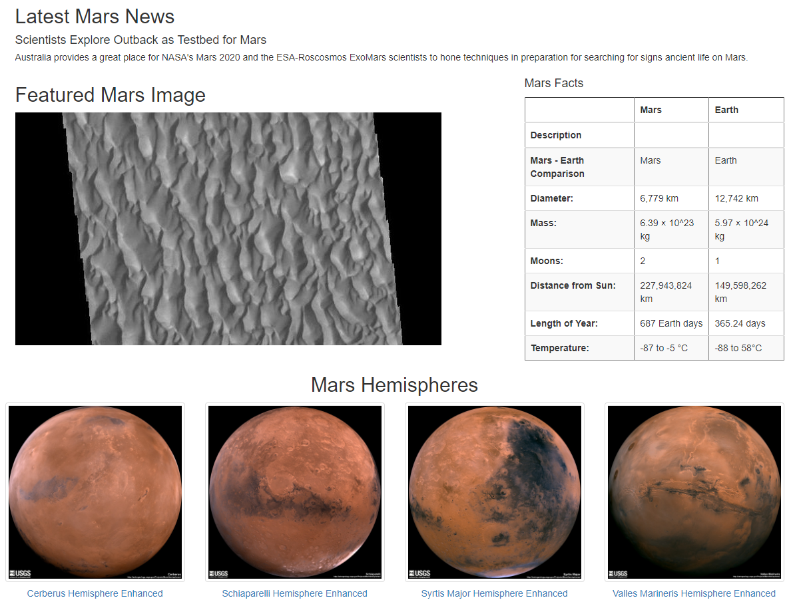

# Mission_to_Mars

## Purpose 
Mission to Mars is a repository created to scrape up-to-date information from NASA's Mars Exploration Program page with the click of a button. The tools and languages used to create the script in this repository are as follows:
* Jupyter Notebook (Anaconda)
* Python 
    - Flask Web Framework
    - Splinter
    - Web-Driver Manager
    - Flask-PyMongo
    - html5lib
    - lxml
    - BeautifulSoup
    - Pandas
    - DateTime
* MongoDB
    - MongoDBCompass
* Chrome Developer Tools
* VSCode
* GitBash
 
 

This repository exemplifies the following skills:
* Creation/Utilization of Virtual Environments
* Interpretation of HTML with Chrome Dev. Tools
* Website Creation and Hosting
* Web Scraping 
* Creation/Utilization of Databases with MongoDB
* Try/Except Error Handling
* Web Application Development
* Creation/Utilization of Interconnected Scripts 
* Utilization of Python Libraries 
* Version Control Through Git 
* Understanding of Front End/Back End HTML 

